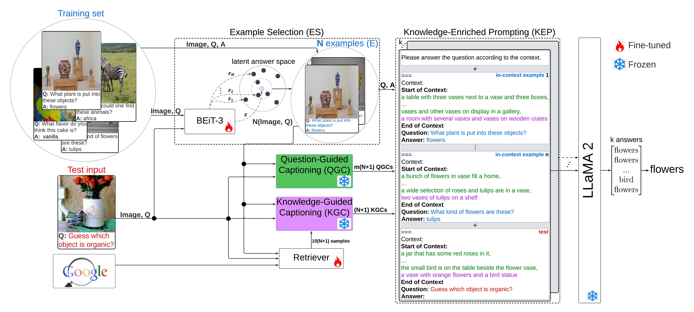

# Framework for VQA



## Install

First, install the necessary dependencies:

```bash
pip install -r requirements.txt
```

---

## **Run the Code**
Before running the code, you need to download the LLaMA 2 weights in the Hugging Face Transformers format from [here](https://huggingface.co/meta-llama/Llama-2-13b-hf). Download MSCOCO 2014 and 2017 datasets from [here](https://cocodataset.org/#download) and put them to dataset folder. MSCOCO 2017 is not needed if you only experiment with OK-VQA.

The datasets folder should have the following structure:

<details>
<summary>Click to expand</summary>

```plaintext
datasets
├── aokvqa
│   ├── aokvqa_v1p0_test.json
│   ├── aokvqa_v1p0_train.json
│   └── aokvqa_v1p0_val.json
├── coco2014
│   ├── train2014
│   └── val2014
├── coco2017
│   ├── test2017
│   ├── train2017
│   └── val2017
├── okvqa
    ├── mscoco_train2014_annotations.json
    ├── mscoco_val2014_annotations.json
    ├── OpenEnded_mscoco_train2014_questions.json
    └── OpenEnded_mscoco_val2014_questions.json
```
</details>

To run the model, use the `run_main.sh` script:

```bash
python main.py \
    --task ok \
    --train_annotations_path annotations/ok_vqa/train_annots_fixed.csv.zip \
    --val_annotations_path annotations/ok_vqa/val_annots_fixed.csv.zip \
    --test_annotations_path None \
    --train_images_dir datasets/coco2014/train2014/ \
    --val_images_dir datasets/coco2014/val2014/ \
    --test_images_dir None \
    --n_shots 10 \
    --k_ensemble 5 \
    --no_of_captions 9 \
    --examples_path beit3_examples/ok_vqa/examples.json \
    --llama_path meta-llama/Llama-2-13b-hf \
    --train_captions_path question_related_captions/ok_vqa/train_data_qr_captions_csv \
    --val_captions_path question_related_captions/ok_vqa/val_data_qr_captions_csv \
    --test_captions_path None \
    --blip_train_question_embedds_path blip_embedds/ok_vqa/blip_normalized_q_embedds/blip_train_question_embedds.csv.zip \
    --blip_train_image_embedds_path blip_embedds/ok_vqa/blip_normalized_i_embedds/blip_train_image_embedds.csv.zip \
    --blip_val_question_embedds_path blip_embedds/ok_vqa/blip_normalized_q_embedds/blip_val_question_embedds.csv.zip \
    --blip_val_image_embedds_path blip_embedds/ok_vqa/blip_normalized_i_embedds/blip_val_image_embedds.csv.zip \
    --finetune False \
    --path_to_save_preds results/okvqa_val.csv
```

---

## Finetuning and Example Selection
If you want to finetune BEiT-3 for in-context example selection yourself, instead of using the provided examples in `beit3_examples/ok_vqa/examples.json`, run the following commands:
```bash
bash scripts/finetune.sh \
    --task ok --version finetune_beit_ok --gpu 0 \
    --pretrained_model /Visual-Question-Answering/beit_pretrained/mp_rank_00_model_states.pt
```
Replace `pretrained_model` with the path of BEiT-3 finetuned on VQAv2. Instructions for VQAv2 finetuning can be found [here](https://github.com/microsoft/unilm/blob/master/beit3/README.md). All epoch checkpoints are saved in `outputs/ckpts/{your_version_name}`. You can then use the finetuned model for in-context example selection by running the following command:
```bash
$ bash scripts/examples_gen.sh \
    --task ok --version okvqa_test_examples_beit \
    --gpu 0 --ckpt_path /path/to/finetuned/model.pkl \
    --example_num 50
```
Replace `ckpt_path` with the path of BEiT-3 finetuned on OK-VQA. The extracted in-context examples will be stored as `examples.json` in `outputs/results/{your_version_name}` directory.

You can finetune the model and select in-context examples for A-OKVQA similar way as above by just replacing `task` with `aok_val` or `aok_test`. The in-context examples for A-OKVQA used in our experiments are provided in `beit3_examples/a_ok_vqa/examples.json`. 

## 📌 Notes
- Ensure you replace `/path_to_the_train_images/` and `/path_to_the_val_images/` with the actual paths to your dataset images.
- The LLaMA model should be placed in `meta-llama/Llama-2-13b-hf`.

## 🙌 Thanks & Acknowledgments
The code in this repository is based on [Simple](https://github.com/alexandrosXe/A-Simple-Baseline-For-Knowledge-Based-VQA), and is extended by fine-tuning a retriever to improve the knowledge retrieval process. The retrieved knowledge was then incorporated into caption generation. Additionally, BEiT-3 was fine-tuned for in-context example selection.  

Many thanks to the authors for making their code publicly available.

